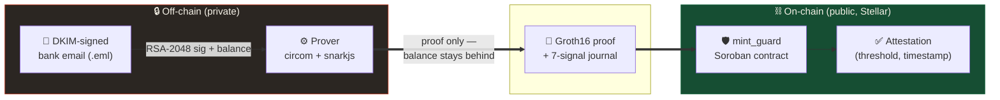
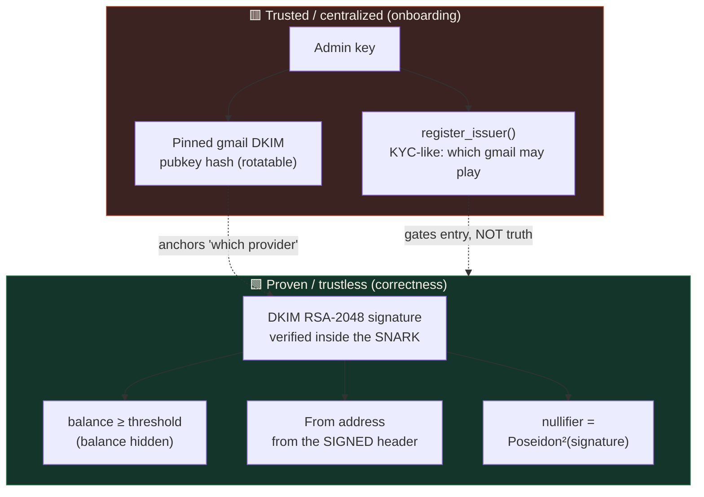
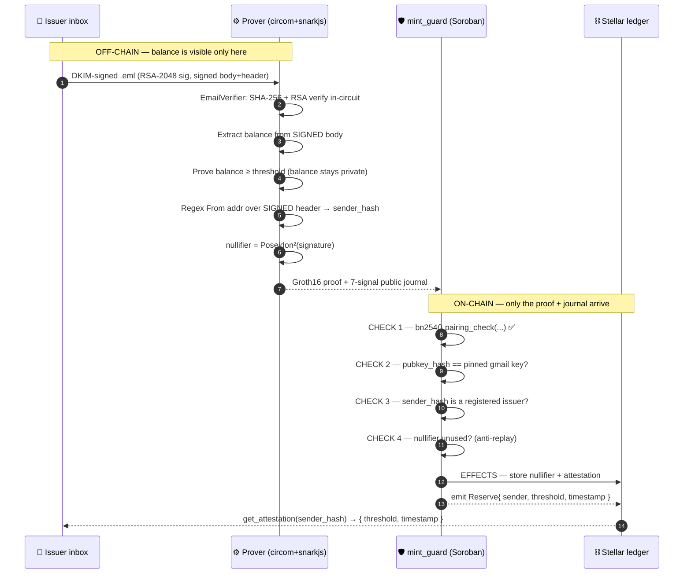
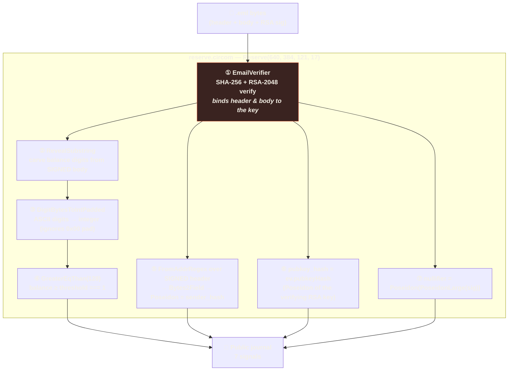
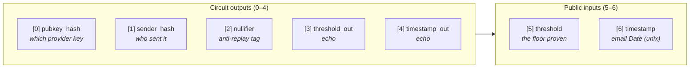
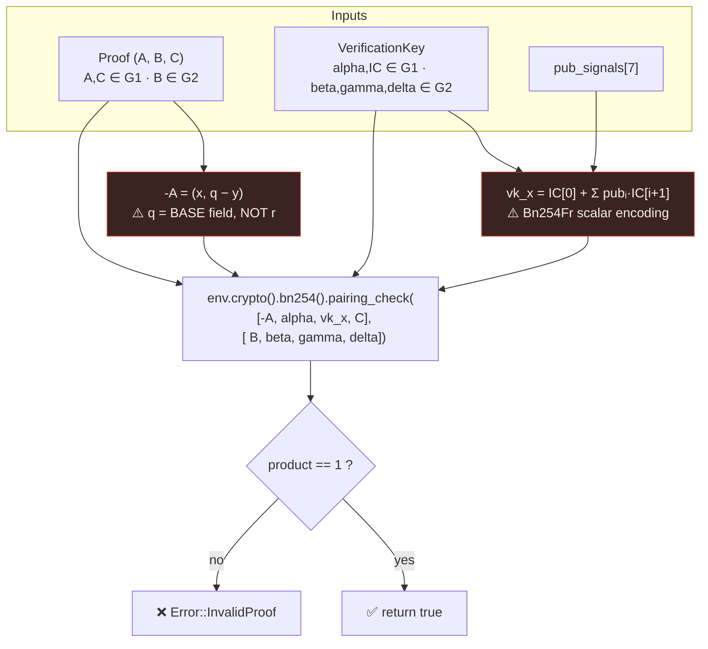
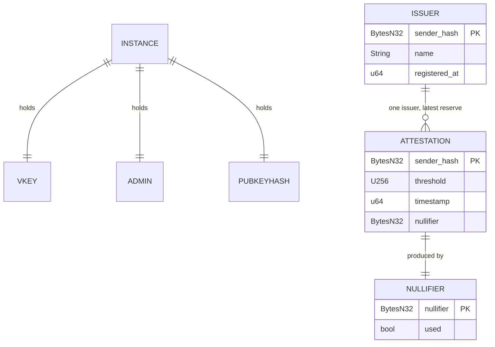
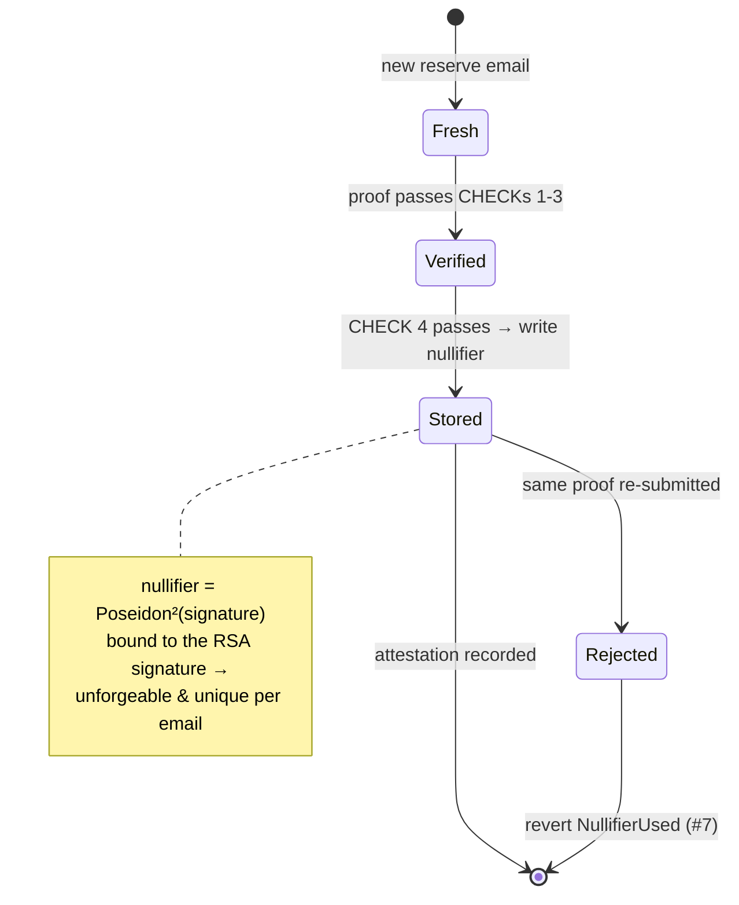
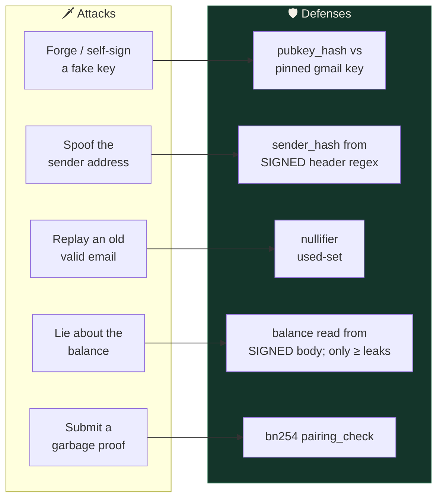
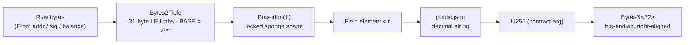

<p align="center">
  
</p>

<h1 align="center">Solvent — System Architecture</h1>

<p align="center">
  <em>Zero-knowledge proof-of-reserves on Stellar.</em><br>
  How a DKIM-signed bank email becomes an on-chain, balance-hiding attestation.
</p>

<p align="center">
  <a href="README.md">← Back to README</a>
</p>

---

## Table of contents

1. [The one-diagram summary](#1--the-one-diagram-summary)
2. [Trust boundaries — what is trusted vs. proven](#2--trust-boundaries--what-is-trusted-vs-proven)
3. [End-to-end sequence](#3--end-to-end-sequence)
4. [Inside the circuit — the seven gates](#4--inside-the-circuit--the-seven-gates)
5. [The public journal — the wire between worlds](#5--the-public-journal--the-wire-between-worlds)
6. [On-chain verification — the Groth16 pairing](#6--on-chain-verification--the-groth16-pairing)
7. [`prove_reserve` — the checks-effects state machine](#7--prove_reserve--the-checks-effects-state-machine)
8. [Storage model](#8--storage-model)
9. [Anti-replay: the nullifier lifecycle](#9--anti-replay-the-nullifier-lifecycle)
10. [Threat model & how each attack dies](#10--threat-model--how-each-attack-dies)
11. [Data encoding across the stack](#11--data-encoding-across-the-stack)
12. [Repository map](#12--repository-map)

---

## 1 · The one-diagram summary

Solvent has exactly **three moving parts** and one hard boundary. An issuer holds
a real, DKIM-signed balance email in their inbox. An **off-chain prover** turns
that email into a Groth16 proof — the balance goes *in*, but only the fact
`balance ≥ threshold` comes *out*. A **Soroban contract** verifies that proof
with Stellar's native BN254 pairing and records an attestation. The dashed line
is the privacy boundary: the real balance never crosses it.



> **The claim in one line:** *"My reserves are ≥ \$1,000,000"* — provable,
> verified on-chain, exact amount never disclosed.

---

## 2 · Trust boundaries — what is trusted vs. proven

The single most important idea in Solvent: **the contract never trusts a
self-declared number.** It trusts only cryptography. The diagram below separates
the world into *"things an operator controls"* (left, red) and *"things math
enforces"* (right, green). Notice the admin can decide **who** may participate,
but has **zero** ability to forge a reserve — that path only opens when a valid
proof passes.



**Reading it:** *Onboarding is centralized; correctness is not.* Every green box
is bound to the bank's real signature. An admin who goes rogue can register a
bogus issuer, but that issuer still cannot mint an attestation without a genuine
DKIM-signed email clearing the threshold.

---

## 3 · End-to-end sequence

This is the full happy path, actor by actor, from an email sitting in an inbox
to an attestation readable on a block explorer. The critical moment is the
`pairing_check` call inside `prove_reserve`: that single native BN254 operation
is the entire cryptographic verdict, and it fits under Stellar's 100M
instruction budget.



**Why it matters:** steps 1–6 happen where the balance is allowed to be seen
(the prover's machine). Everything from step 7 onward only ever sees the proof
and the journal — the balance is mathematically absent from the wire.

---

## 4 · Inside the circuit — the seven gates

`circuits/reserve.circom` is a pipeline of seven constraint blocks. The input on
the far left is the raw `.eml`; the output on the far right is the 7-signal
journal. Every downstream fact (balance, sender, nullifier) is chained back to
**one** root of trust: the RSA signature verified in gate ①. If gate ① fails,
the witness cannot even be generated — nothing downstream can be forged.



**Gate-by-gate:**

| Gate | Template | Guarantee it provides |
|------|----------|------------------------|
| ① | `EmailVerifier` | The header **and** body are the exact bytes the bank's RSA-2048 key signed. This is the single root of trust. |
| ② | `RevealSubstring` | The balance digits are genuinely a slice of the **signed** body — not prover-injected. |
| ③ | `DigitBytesToIntPadded` | Folds ASCII digits into a field integer while skipping `0x00` padding, so the value is derived purely from verified bytes. |
| ④ | `GreaterEqThan(128)` | The **only** numeric claim that leaves the circuit: `balance ≥ threshold`. The balance itself is never output. |
| ⑤ | `FromAddrRegex` → `Poseidon` | Extracts the **full** From address from the signed header (full address, because `gmail.com` is shared) and hashes it → `sender_hash`. Closes sender-spoofing. |
| ⑥ | `ev.pubkeyHash` | Poseidon hash of the RSA key that actually verified the signature → tells the contract **which provider** signed. |
| ⑦ | `Poseidon²(signature)` | A unique, unforgeable tag per email → anti-replay `nullifier`. |

---

## 5 · The public journal — the wire between worlds

The journal is the **only** data that crosses from prover to chain. Its order is
fixed by snarkjs (`public.json`): circuit **outputs** first, then public
**inputs**. The contract hard-codes these indices (`J_PUBKEY_HASH = 0`, …), so
the layout below is a binding contract between the two codebases. Look closely:
there is no `balance` field anywhere.



**How the contract consumes it** — three signals become 32-byte storage keys,
two become the attestation payload, and the echoes let the verifier bind
outputs to inputs:

| idx | signal | on-chain role |
|-----|--------|----------------|
| 0 | `pubkey_hash` | compared to the pinned gmail DKIM key hash → **CHECK 2** |
| 1 | `sender_hash` | registry lookup key → **CHECK 3**; also the attestation key |
| 2 | `nullifier` | anti-replay set key → **CHECK 4** |
| 3 | `threshold_out` | echo — binds output to public input |
| 4 | `timestamp_out` | echo — binds output to public input |
| 5 | `threshold` | stored in the `Attestation` |
| 6 | `timestamp` | stored in the `Attestation` |

> **The balance is absent by construction.** The journal can only ever reveal the
> floor that was cleared, never the reserve behind it.

---

## 6 · On-chain verification — the Groth16 pairing

`verify_proof` reduces the whole thing to a single equation. Groth16 is
rearranged so the pairing **product equals one**:

```
e(-A, B) · e(alpha, beta) · e(vk_x, gamma) · e(C, delta) == 1
        where   vk_x = IC[0] + Σ  pub[i] · IC[i+1]
```

The diagram shows how the four pairing terms are assembled from the proof
`(A, B, C)`, the stored verification key, and the public journal. Two subtle
correctness traps are called out in red — both are classic silent-failure bugs
that Solvent handles explicitly.



**The two traps, made explicit:**

- **Negation over the wrong field.** `-A` negates the Y-coordinate mod **q**
  (the base field `Fq`), *not* mod `r` (the scalar field). Mixing them yields a
  proof that *looks* valid but fails `pairing_check`. Solvent pins `q` as a
  constant and negates via `U256` arithmetic.
- **Scalar/point encoding.** `vk_x` is built with `Bn254Fr` scalars and
  big-endian G1/G2 byte layouts (with the EIP-197 `[c1, c0]` swap done in the
  vkey exporter). A `debug_vk_x` helper lets tests bisect this in isolation.

---

## 7 · `prove_reserve` — the checks-effects state machine

The core entry point follows a strict **checks-effects** discipline: *all four
checks pass before any state is written.* If any check fails, the transaction
reverts with a typed error and the ledger is untouched — no half-written
nullifier, no orphan attestation. The diagram is the exact control flow of the
function.

```mermaid
stateDiagram-v2
    [*] --> Check1
    Check1: CHECK 1 — pairing_check(proof)
    Check2: CHECK 2 — pubkey_hash == pinned gmail key
    Check3: CHECK 3 — sender_hash ∈ registry
    Check4: CHECK 4 — nullifier unused
    Effects: EFFECTS — write nullifier + attestation
    Event: emit Reserve{sender, threshold, timestamp}
    Done: [*]

    Check1 --> Check2: valid
    Check1 --> E4: InvalidProof (#4)
    Check2 --> Check3: match
    Check2 --> E5: WrongPubkey (#5)
    Check3 --> Check4: registered
    Check3 --> E6: IssuerNotRegistered (#6)
    Check4 --> Effects: fresh
    Check4 --> E7: NullifierUsed (#7)
    Effects --> Event --> Done

    E4: revert
    E5: revert
    E6: revert
    E7: revert
```

**Error surface** (every failure is typed, so callers get a precise reason):

| Code | Error | Meaning |
|------|-------|---------|
| 1 | `NotInitialized` | `init` never ran |
| 2 | `AlreadyInitialized` | `init` called twice |
| 3 | `BadPublicInputLen` | `IC.len() ≠ pub_signals.len() + 1` |
| 4 | `InvalidProof` | pairing check failed |
| 5 | `WrongPubkey` | signer is not the pinned gmail DKIM key |
| 6 | `IssuerNotRegistered` | sender not onboarded |
| 7 | `NullifierUsed` | replayed email |

---

## 8 · Storage model

The contract splits state into two Soroban lifetimes. **Instance** storage holds
the singleton config (admin, verification key, pinned key hash) — small, always
loaded. **Persistent** storage holds the growing sets keyed by 32-byte hashes:
the issuer registry, the used-nullifier set, and the latest attestation per
issuer.



| Key | Lifetime | Value | Written by |
|-----|----------|-------|------------|
| `Admin` | instance | `Address` | `init` |
| `Vkey` | instance | `VerificationKey` | `init` / `set_vkey` |
| `PubkeyHash` | instance | `BytesN<32>` | `init` / `set_pubkey_hash` |
| `Issuer(sender_hash)` | persistent | `IssuerInfo` | `register_issuer` |
| `Nullifier(nullifier)` | persistent | `bool` | `prove_reserve` |
| `Attestation(sender_hash)` | persistent | `Attestation` | `prove_reserve` |

---

## 9 · Anti-replay: the nullifier lifecycle

The nullifier is what stops someone from re-submitting the same proof forever. It
is deterministic — `Poseidon²(signature)` — so the *same* email always yields the
*same* tag, but a *fresh* reserve email yields a new one. The contract stores it
on first use and rejects any second sighting **before** touching state.



**Live proof:** on testnet, submitting the same proof twice fails the second time
with `Error(Contract, #7)` — verifiable in the transaction chain.

---

## 10 · Threat model & how each attack dies

Every realistic attack maps to exactly one defense, and every defense is either
math (green) or a pinned constant (amber). Nothing here rests on "trust the
operator."



| Attack | Dies because | Enforced in |
|--------|--------------|-------------|
| Forged / self-signed key | `pubkey_hash` must equal the pinned gmail DKIM hash | contract CHECK 2 |
| Spoofed sender | `sender_hash` comes from a regex over **signed** header bytes | circuit gate ⑤ |
| Replay | `nullifier` is stored on first use | contract CHECK 4 |
| Fake balance | balance read from **signed** body; only `≥ threshold` is provable | circuit gates ②–④ |
| Junk proof | Groth16 `pairing_check` returns false | contract CHECK 1 |

---

## 11 · Data encoding across the stack

A recurring source of ZK bugs is encoding drift between the circuit, the exporter,
and the contract. Solvent locks each hop. This diagram traces one field element —
say the From address — from raw bytes to an on-chain 32-byte key, and lists the
encoding rule at every boundary.



**Locked rules (must match byte-for-byte):**

- **`Bytes2Field`** ↔ `circuits/scripts/serialize.js`: 31-byte little-endian
  limbs, right-padded with `0x00`, folded with `BASE = 2²⁴⁸`.
- **G1 / G2 layout** ↔ `vkey_to_soroban.js`: `G1 = be(X)‖be(Y)`;
  `G2 = be(X_c1)‖be(X_c0)‖be(Y_c1)‖be(Y_c0)` (EIP-197 order — the exporter swaps
  snarkjs's `[c0, c1]`).
- **Journal order** ↔ `mint_guard` index constants: outputs first, then inputs.
- **`U256 → BytesN<32>`**: big-endian, right-aligned so short encodings keep
  leading zeros.

---

## 12 · Repository map

```
Solvent/
├── circuits/
│   ├── reserve.circom          ① the seven-gate circuit (§4)
│   ├── build.sh                compile → trusted setup → vkey
│   ├── scripts/
│   │   ├── gen_input.js         .eml → circuit witness input
│   │   ├── serialize.js         LOCKED byte→field fold (§11)
│   │   ├── vkey_to_soroban.js   vkey → Soroban G1/G2 encoding (§6, §11)
│   │   └── gen_contract_fixtures.js  real proof → Rust test fixture
│   └── fixtures/               DKIM DNS + sample emails
│
├── contracts/mint_guard/
│   ├── src/lib.rs              the verifier + registry + attestation (§6–§9)
│   ├── src/test.rs             8/8 tests: pairing, tamper, replay, wrong-key
│   └── scripts/
│       ├── deploy_init.sh       deploy + init + register
│       └── prove.sh             format BN254 args + submit prove_reserve
│
├── solvent-web/                React frontend (landing + prove console)
│
├── README.md                   ← start here
├── ARCHITECTURE.md             ← you are here
└── DEPLOYMENT.md               live testnet contract + verifiable tx chain
```

---

<p align="center">
  <a href="README.md">← Back to README</a> ·
  <a href="DEPLOYMENT.md">Live deployment →</a>
</p>
